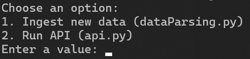

# vivpro-take-home
This repository contains my solution for Vivpro's Backend Take Home assignment

---

Table of Contents:

1. [Overview](#overview)
2. [Setup](#setup)
3. [Running the project](#running-the-project)
4. [Technical Description](#technical-description)
    i. [dataParsing.py](#1-dataparsingpy)
    ii. [db.py](#2-dbpy)
    iii. [api.py](#3-apipy)
    iv. [main.py](#4-mainpy)
5. Test Cases

---

## Overview:
This project aims to:
1. Normalize a nested JSON dataset of songs into a clean, tabular format.
2. Store this data in a sqlite database for use in a backend API.
3. Provide API endpoints to:
   - Retrieve all songs with pagination.
   - Look up a song by title.
   - Add rating to a song

---

## Setup:
I like to use Chocolatey since I'm on a Windows machine. The steps to install chocolatey can be found [here](https://chocolatey.org/install).
1. In an elevated terminal, run the command `choco install python` (installs latest available package - use `choco install python --versionx.xx.x` if you need a specific version). It will ask if you want to run the script - enter `Y` to proceed.
2. After the installation is complete, run `python --version` to verify that it has been installed correctly.
3. Now, install the following packages for this project:
    
    i. pandas: `pip install pandas`  
    ii. pydantic: `pip install pydantic`  
    iii. flask: `pip install flask`

The environment should now be set up.

---

## Running the project:

Before you can run the program, please ensure that your raw input JSON is present in the `/input` folder, and the filepath is configured correctly in `config.json`. 
To run the project, navigate to the directory and run the command `python main.py`. You will be presented with 2 options: 

 
Select 1 to ingest the new JSON file. After the data has been ingested once, run `python main.py` again and  select 2 to run the API.
The API will run until the user interrupts it with a `CTRL+C` command.
Once the data has been ingested, the API can be run any number of times, since the data is held persistently in a SQLite database.

---

## Technical Description:

The project is split into 2 parts: The data ingestion and the API backend, to decouple the steps for better flexibility.

### 1. dataParsing.py

This module is responsible for the ingestion, validation and persistence of the music playlist data. The input is a raw JSON file in a columnised format, and the data is stored in a persistent SQLite database after processing. It uses standard python librarires, along with pydantic for validation, pandas for easily handling the data and sqlite3 for the database, creating a robust ETL process.

key Responsibilities:
1. Read the input JSON file specified in config.json
2. Validate each row of the dataset using a pydantic modfel.
    - A `Song` model is defined using the Pydantic library.
    - Each row of the data must conform to the expected datatypes. If any field is missing or invalid, the row is skipped and an error is logged. 
3. Convert valid entries into a pandas DataFrame.
4. Save the cleaned and structured data into a SQLite database specified in config.json, for persistence.

Additionally, Logging is implemented at console level and to a file in the `/logs` directory. Each step of the process is logged, from function invocations to validation errors with a specific row of data. The code uses a config file instead of hardcoded variables, to ensure ease of managing envrionment variables. The `ratings` field is 'Optional' in the Pydantic model, so that songs can be validated even if they don't have ratings, and it can be added later through the API or an updated JSON. One issue I had to work around is that the reserved keyword `class` was also a field name, necessitating the use of an alias `class_`.

The operations are split into 3 separate functions - `load_data`, `validate_songs` and `save_to_db` for readability, maintainability and easier testing.

Input Files:
-Raw JSON data 
    From the path specified in config.json

Output Files
- Validated and clean song data is saved to: 
    SQLite DB: data/playlist.db (table: songs)
- Logs are written to: 
    Log file: logs/dataParsing.log

### 2. db.py

The `dp.py` file serves as the database access layer for the application. It encapsulates all direct interactions with the SQLite database, ensuring clean separation between business logic and storage logic. This module is imported by the API server to fetch, query, and update song data without dealing directly with SQL or database connections.
Implementing the database connection in this way allows an easier path to swap to another database (Like PostgreSQL or Oracle).

Key Responsibilities:
1. Connect to the SQLite database (playlist.db)
2. Fetch all songs
3. Fetch a single song by its ID
4. Update the rating of a specific song
5. Log all major database operations and errors

It implements a named logger, since using basicConfig for both db.py and api.py results in a conflict and leads to api.log not being populated. It ensures that the directory exists, and the logs are also printed to console.

`conn.row_factory = sqlite3.Row` allows the databse rows to behave like dictionaries, making them easier to work with in the Flask API.

All database connections use `get_connection()` to improve code flow and error handling, and ensure connections are closed after use.
`update_rating()` returns the number of rows updated, allowing the API to determine if the update was successful or not.

Input Files:
-Database connection 
    SQLite DB: data/playlist.db (specified in config.json) 

Output Files
- updated ratings are saved to: 
    SQLite DB: data/playlist.db (table: songs)
- Logs are written to: 
    Log file: logs/dataParsing.log

### 3. api.py

The api.py file is the main web server for this music playlist application. It provides RESTful endpoints for accessing and modifying song data stored in a SQLite database.
This Flask-based API supports three major operations:
1. Retrieve all songs with pagination (GET)
2. Fetch song by ID (GET)
3. Update rating of a song by ID (POST)

The endpoint /songs accepts `page` and `limit` query parameters, allowing pagination and enabling the database to scale with larger datasets. Invalid parameters are handled with error messages.

Database access is delegated to db.py, keeping teh API logic clean and focused on handling the business logic for API requests and responses.

The `/rate` endpoint requires a JSON format, and validates that the rating exists within the JSON, is numeric and lies between 0-5(float), ensuring that data quality is maintained.

The API returns the following HTTp codes:
- `200 OK` for successful responses
- `400 Bad Request` when validation issues are encountered with query params/JSON body
- `404 Not Found` when a song with the given ID does not exist.

This also uses a named logger to avoid conflicts with db.py, and writes the logs to the `/logs/api.log` file, as well as to the console. The logging is configured to capture all API activity, including requests, pagination info, validation features and successful operations.

The default port used is localhost:5000 (127.0.0.1:5000).

### 4. main.py

This is a simple main file that present the user with options to run the desired program. They can choose between running `dataParsing.py` or `api.py`, making it easy for the user to run it with a simple `python main.py` command and not worry about the individual modules.